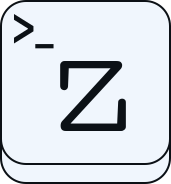
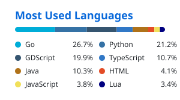

## Hi there 👋

I enjoy coding emulators, video games, discord bots, and fun little programs that may or may not make my life easier.

-  [Neovim](https://github.com/is386/nvim) is my editor
-  [Zoxide](https://github.com/ajeetdsouza/zoxide) is one of my favorite command-line tools
-  These are my [dotfiles](https://github.com/is386/dotfiles)
-  Here is my [Itch.io](https://1nder-games.itch.io/) page
- ⌨️ My keyboard is a [Keychron V1 Ultra](https://www.keychron.com/products/keychron-v1-ultra-8k-wireless-custom-mechanical-keyboard) with [Keygeek Y2 switches](https://unikeyboards.com/products/keygeek-y2-linear-switch-factory-lubed-10pcs)

  <picture>
    <source media="(prefers-color-scheme: dark)" srcset="profile/stats.svg" />
    
  </picture>
  <picture>
    <source media="(prefers-color-scheme: dark)" srcset="profile/top-langs.svg" />
    
  </picture>

